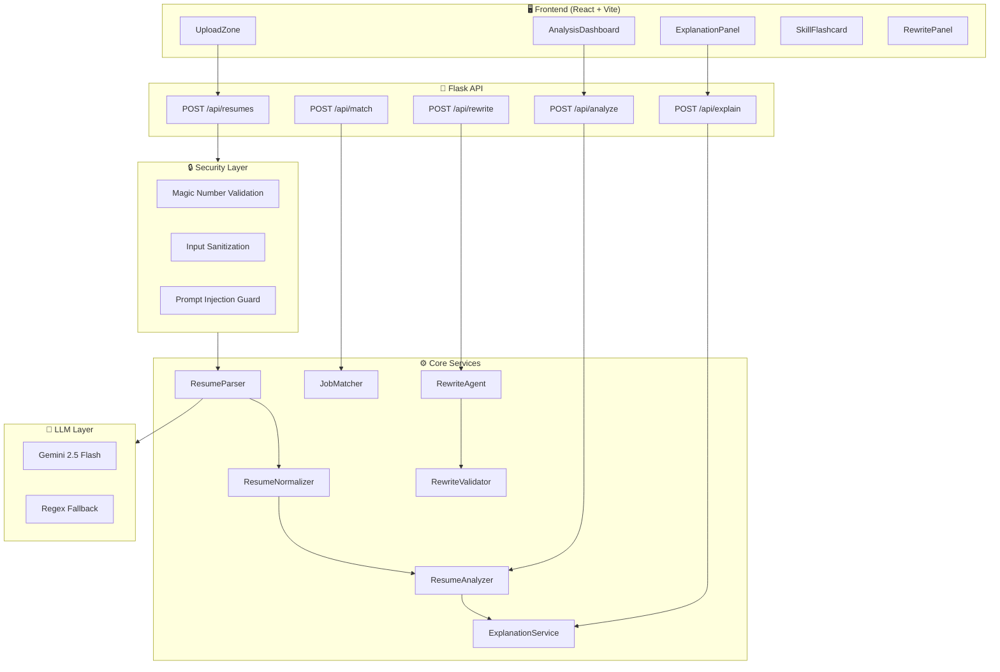
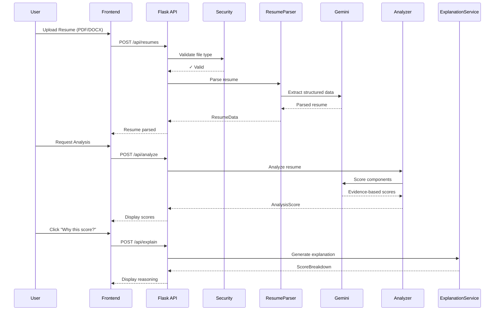
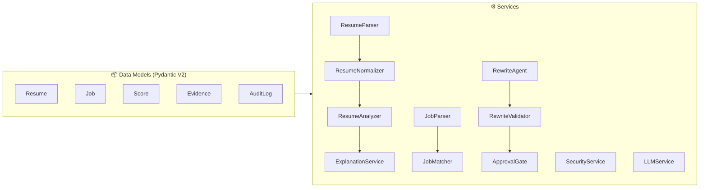
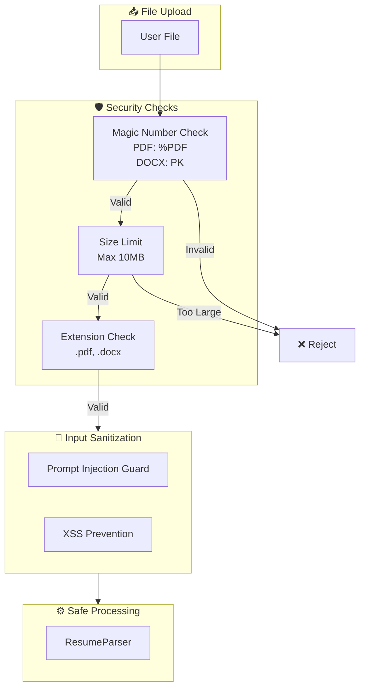
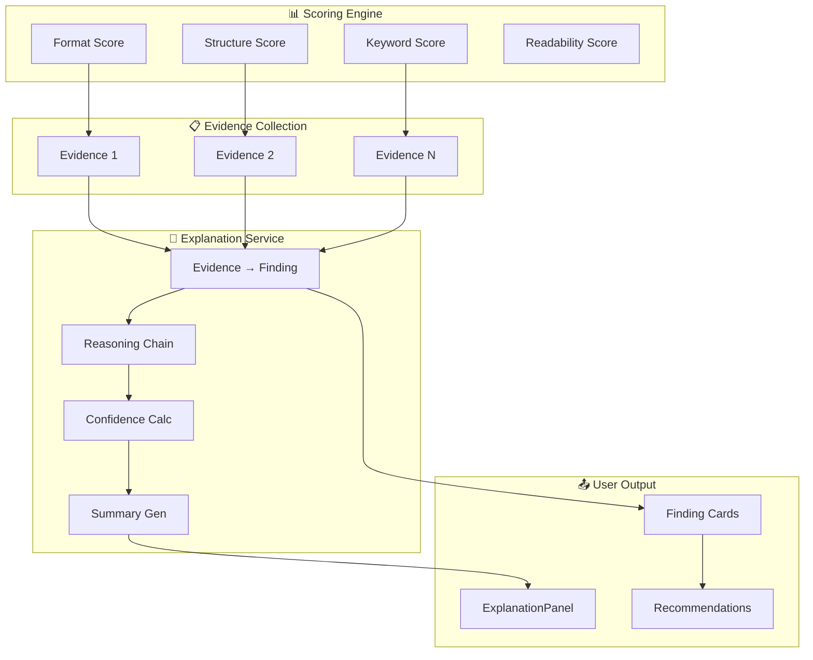

# VeriFit Architecture

Comprehensive architecture documentation for VeriFit.

---

## System Overview



---

## Data Flow



---

## Service Architecture



---

## Security Architecture



---

## XAI (Explainability) Architecture



---

## Technology Stack

| Layer | Technology | Purpose |
|-------|------------|---------|
| **Frontend** | React 19 + Vite | UI rendering |
| **UI Framework** | Material UI 7 | Design system |
| **Animations** | Framer Motion | Micro-interactions |
| **Backend** | Flask | REST API |
| **Data Models** | Pydantic V2 | Validation |
| **LLM** | Gemini 2.5 Flash | AI processing |
| **Rate Limiting** | Tenacity | Retry logic |

---

## Directory Structure

```
VeriFit/
├── assets/                 # Screenshots & media
├── client/
│   └── src/
│       ├── api/
│       │   └── client.ts   # API client
│       └── components/
│           ├── AnalysisDashboard.tsx
│           ├── ExplanationPanel.tsx
│           ├── Footer.tsx
│           ├── RewritePanel.tsx
│           ├── SkillFlashcard.tsx
│           └── UploadZone.tsx
├── docs/
│   ├── adr/               # 8 Architecture Decision Records
│   ├── ARCHITECTURE.md
│   ├── SETUP.md
│   └── TROUBLESHOOTING.md
├── src/
│   ├── app.py             # Flask application
│   ├── models/            # Pydantic data models
│   │   ├── audit.py
│   │   ├── job.py
│   │   ├── resume.py
│   │   ├── rewrite.py
│   │   └── score.py
│   ├── services/          # Business logic (13 services)
│   │   ├── approval_gate.py
│   │   ├── explanation_service.py
│   │   ├── job_matcher.py
│   │   ├── job_parser.py
│   │   ├── llm.py
│   │   ├── resume_analyzer.py
│   │   ├── resume_normalizer.py
│   │   ├── resume_parser.py
│   │   ├── rewrite_agent.py
│   │   ├── rewrite_validator.py
│   │   ├── score_explainer.py
│   │   └── security.py
│   └── utils/
├── tests/                  # Python tests
├── uploads/                # Temporary file storage
├── CONTRIBUTING.md
├── LICENSE
├── README.md
├── requirements.txt
└── SYSTEM.md
```

---

## SYSTEM.md Compliance

All architecture decisions follow [SYSTEM.md](../SYSTEM.md) principles:

| Principle | Implementation |
|-----------|----------------|
| Explainability First | XAI Layer with reasoning chains |
| No Hallucination | RewriteValidator + Evidence-based scoring |
| Privacy-Preserving | No data retention, file cleanup |
| Human-in-the-Loop | ApprovalGate for rewrites |
| Research-Driven | ADRs for all major decisions |
